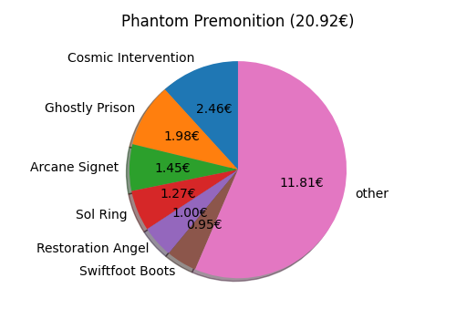

[](https://github.com/DiddiZ/mtg-proxies/actions/workflows/python-package.yml)

# MtG-Proxies

Create a high quality printable PDF from your decklist or a list of cards you want to proxy.


## Features

- **High resolution prints**  
  In contrast to online tools that provide this service (e.g. [MTG Press](http://www.mtgpress.net/)), this project creates the PDF file locally.
  This allows to use highest resolution Scryfall scans to create a large, high-dpi PDF file without regard for bandwidth limitations. For example, the generated PDF for a complete Commander decklist has a size of about 140MB.

- **Up-to-date card scans**  
  By directly utilizing the Scryfall API, all the latest sets are automatically availble as soon as they're available on Scryfall (which is usually incredibly fast). To not overrun Scryfall with requests, this project makes use of [Scryfall bulk data](https://scryfall.com/docs/api/bulk-data) to reduce API calls as much as possible. As requested by Scryfall, a small delay of 100ms is added between requests. However, as most work is done with a local copy of the bulk data, this is hardly noticeable.

- **Support for both text and Arena format decklists**
  `mtg-proxies` can work with both text and Arena format decklists.
  The Arena format is recommended, as it allows you to keep the same prints when moving decklists between multiple tools.
  There are even cases (i.e. tokens) where the name alone is not sufficient to uniquely specify a card.
  The Arena format helps in these case, as set and collector number are unique identifiers.
  However, as tools often only work with one of these formats, `mtg-proxies` is as flexible as possible, even supporting mixed mode.
  This is especially useful when you are making quick additions to a decklist and don't want to search for set and collector numbers.
  The `convert.py` tool can be used to convert decklists between the two formats.

- **Sanity checks and recommender engine**  
  `mtg-proxies` warns you if you attempt to print a low-resolution scan and is able to offer alternatives.
  The `convert.py` tool can automatically select the best print for each card in a decklist with high accuracy, eliminating the need to manually select good prints.

- **Token support**  
  The `tokens.py` tool appends the tokens created by the cards in a decklist to it, so you don't miss one accidentally. Caveat: This only works when Scryfall has the data on associated tokens. This is the case for cards printed or reprinted since Tenth Edition.

- **ManaStack and Archidekt integration**
  Directly use ManaStack and Archidekt deck ids as input for many functions instead of local decklist files.

  Decks on Archidekt must be set as public to be read.

## Usage

1. Clone or download this repo.

   ```bash
   git clone https://github.com/DiddiZ/mtg-proxies.git
   cd mtg-proxies
   ```

2. Install requirements. Requires at least [Python 3.9](https://www.python.org/downloads/).
   You can use pip or PDM to install the dependencies.

   - Install using pip (you can use a [virtual environment](https://docs.python.org/3/library/venv.html)).
     ```bash
     # On Linux, use `python3` instead of `python`
     python -m venv .venv # Create a virtual environment
     source .venv/bin/activate # Activate the virtual environment
     # on Windows, run .venv\Scripts\activate.bat or .venv\Scripts\Activate.ps1
     python -m pip install -e . # Install in editable mode
     ```
   - Install using PDM (recommended)
     ```bash
     pdm install # creates a virtual env. and installs dependencies on its own
     ```

3. (Optional) Prepare your decklist in MtG Arena format.
   This is not required, but recommended as it allows for more control over the process.

   ```txt
   COUNT FULL_NAME (SET) COLLECTOR_NUMBER
   ```

   E.g.:

   ```txt
   1 Alela, Artful Provocateur (ELD) 324
   1 Korvold, Fae-Cursed King (ELD) 329
   1 Liliana, Dreadhorde General (WAR) 97
   1 Murderous Rider // Swift End (ELD) 287
   ```

   Or use the `convert.py` tool to convert a plain decklist to Arena format:

   ```bash
   python convert.py examples/decklist_text.txt examples/decklist.txt
   ```

4. Assemble your proxies into a document.

   To find out what options are available, run:

   ```bash
   pdm run python print.py --help
   ```

   There are two commands available: `pdf` and `image`.

   ```python
   pdm run python print.py image --help
   pdm run python print.py pdf --help
   ```

Examples:

- Create separate outputs for front and back faces

```bash
python print.py examples/decklist.txt decklist_fronts.pdf --face front
python print.py examples/decklist.txt decklist_backs.pdf --face back
```

## Updating

```bash
git pull --ff-only
python -m pip install -e .
```

## Help

### print

```txt
pdm run python print.py --help
Usage: print.py [OPTIONS] COMMAND [ARGS]...

Options:
  --help  Show this message and exit.

Commands:
  image  This command generates an image file at OUTPUT_FILE with the...
  pdf    This command generates a PDF document at OUTPUT_FILE with the...
```

### convert

```txt
usage: pipenv run python convert.py decklist outfile [OPTIONAL ARGUMENTS]

Convert a decklist from text format to arena format or vice-versa.

positional arguments:
  decklist_spec         path to a decklist in text/arena format, or manastack:{manastack_id}, or archidekt:{archidekt_id}
  outfile               output file

optional arguments:
  -h, --help            show this help message and exit
  --format {arena,text}
                        output format (default: arena)
  --clean               remove all non-card lines
```

### tokens

```txt
usage: pipenv run python tokens.py decklist [OPTIONAL ARGUMENTS]

Append the tokens created by the cards in a decklist to it.

positional arguments:
  decklist_spec         path to a decklist in text/arena format, or manastack:{manastack_id}, or archidekt:{archidekt_id}

optional arguments:
  -h, --help            show this help message and exit
  --format {arena,text}
                        output format (default: arena)
```

Example:

```bash
python tokens.py examples/token_generators.txt
```

### Deck Value Decomposition

```txt
usage: deck_value.py decklist [OPTIONAL ARGUMENTS]

Show deck value decomposition.

positional arguments:
  decklist_spec         path to a decklist in text/arena format, or manastack:{manastack_id}, or archidekt:{archidekt_id}

optional arguments:
  -h, --help            show this help message and exit
  --lump-threshold FLOAT
                        lump together cards with lesser proportional value
```

Example:

```bash
pipenv run python deck_value.py manastack:1234536
pipenv run python deck_value.py archidekt:365563
```



## Acknowledgements

- [MTG Press](http://www.mtgpress.net/) for being a very handy online tool, which inspired this project.
- [Scryfall](https://scryfall.com/) for their [excellent API](https://scryfall.com/docs/api).
