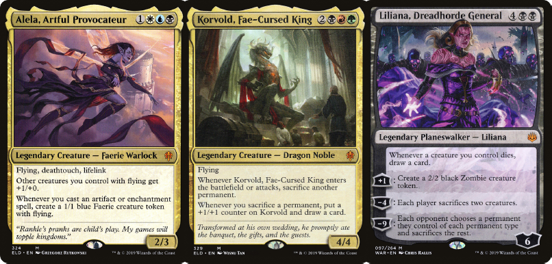

# MtG-Proxies

Create a high quality printable PDF from your decklist or a list of cards you want to proxy.



## Features

- **High resolution prints**  
  In contrast to online tools that provide this service (e.g. [MTG Press](http://www.mtgpress.net/)), this project creates the PDF file locally.
  This allows to use highest resolution Scryfall scans to create a large, high-dpi PDF file without regard for bandwidth limitations. For example, the generated PDF for a complete Commander decklist has a size of about 140MB.

- **Up-to-date card scans**  
  By directly utilizing the Scryfall API, all the latest sets are automatically availble as soon as they're available on Scryfall (which is usually incredibly fast). To not overrun Scryfall with requests, this project makes use of [Scryfall bulk data](https://scryfall.com/docs/api/bulk-data) to reduce API calls as much as possible. As requested by Scryfall, a small delay of 100ms is added between requests. However, as most work is done with a local copy of the bulk data, this is hardly noticeable.

- **Support for both text and Arena format decklists**
  `mtg-proxies` can work with both text and Arena format decklists.
  The Arena format is recommended, as it allows you to keep the same prints when moving decklists between multiple tools.
  There are even cases (i.e. tokens) where the name alone is not sufficient to uniquely specify a card.
  The Arena format helps in these case, as set and collector number are unique identifiers.
  However, as tools often only work with one of these formats, `mtg-proxies` is a flexible as possible, even supporting mixed mode.
  This is especially when you are making quick additions to a decklist and don't want to search for set and collector numbers.
  The `convert.py` tool can be used to convert decklists between the two formats.

- **Sanity checks and recommender engine**  
  `mtg-proxies` warns you if you attempt to print a low-resolution scan and is able to offer alternatives.
  The `convert.py` tool can automatically selects the best print for each card in a decklist with high accuracy, eliminating the need to manually select good prints.

- **Token support**  
  The `tokens.py` tool appends the tokens created by the cards in a decklist to it, so you don't miss one accidentally. Caveat: This only works when Scryfall has the data on associated tokens. This is the case for cards printed or reprinted since Tenth Edition.

- **ManaStack integration**
  Directly use ManaStack deck ids input for many functions instead of local decklist files.

## Usage

1. Clone or download this repo.

```bash
git clone https://github.com/DiddiZ/mtg-proxies.git
cd mtg-proxies
```

2. Install requirements. Requires at least [Python 3.8](https://www.python.org/downloads/).

```bash
# On Linux, use `python3` instead of `python`
python -m pip install --user -U pipenv

# Make sure pipenv is included in your PATH, otherwise the next step will fail
pipenv install --deploy
```

3. (Optional) Prepare your decklist in MtG Arena format.
   This is not required, but recommended as it allows for more control over the process.

```txt
COUNT FULL_NAME (SET) COLLECTOR_NUMBER
```

E.g.:

```txt
1 Alela, Artful Provocateur (ELD) 324
1 Korvold, Fae-Cursed King (ELD) 329
1 Liliana, Dreadhorde General (WAR) 97
1 Murderous Rider // Swift End (ELD) 287
```

Or use the `convert.py` tool to convert a plain decklist to Arena format:

```bash
pipenv run python convert.py examples/decklist_text.txt examples/decklist.txt
```

4. Create a PDF file.

```bash
pipenv run python print.py examples/decklist.txt decklist.pdf
```

## Help

### print

```txt
pipenv run python print.py [-h] [--dpi DPI] decklist outfile

Prepare a decklist for printing.

positional arguments:
  decklist              a decklist in text or Arena format, or ManaStack id
  outfile               output file. Supports pdf, png and jpg.

optional arguments:
  -h, --help            show this help message and exit
  --dpi DPI             dpi of output file (default: 300)
  --paper WIDTHxHEIGHT  paper size in inches or preconfigured format (default: a4)
  --scale FLOAT         scaling factor for printed cards (default: 1.0)
  --border_crop PIXELS  how much to crop inner borders of printed cards (default: 14)
  --background COLOR    background color, either by name or by hex code (e.g. black or "#ff0000", default: None)
```

### convert

```txt
usage: pipenv run python convert.py decklist outfile [OPTIONAL ARGUMENTS]

Convert a decklist from text format to arena format or vice-versa.

positional arguments:
  decklist              a decklist in text or Arena format, or ManaStack id
  outfile               output file

optional arguments:
  -h, --help            show this help message and exit
  --format {arena,text}
                        output format (default: arena)
  --clean               remove all non-card lines
```

### tokens

```txt
usage: pipenv run python tokens.py decklist [OPTIONAL ARGUMENTS]

Append the tokens created by the cards in a decklist to it.

positional arguments:
  decklist              a decklist in text or Arena format, or ManaStack id

optional arguments:
  -h, --help            show this help message and exit
  --format {arena,text}
                        output format (default: arena)
```

Example:

```bash
pipenv run python tokens.py examples/token_generators.txt
```

### Deck Value Decomposition

```txt
usage: deck_value.py decklist [OPTIONAL ARGUMENTS]

Show deck value decomposition.

positional arguments:
  decklist              a decklist in text or Arena format, or ManaStack id

optional arguments:
  -h, --help            show this help message and exit
  --lump-threshold FLOAT
                        lump together cards with lesser proportional value
```

Example:

```bash
pipenv run python deck_value.py 1234536
```

## Acknowledgements

- [MTG Press](http://www.mtgpress.net/) for being a very handy online tool, which inspired this project.
- [Scryfall](https://scryfall.com/) for their [excellent API](https://scryfall.com/docs/api).
